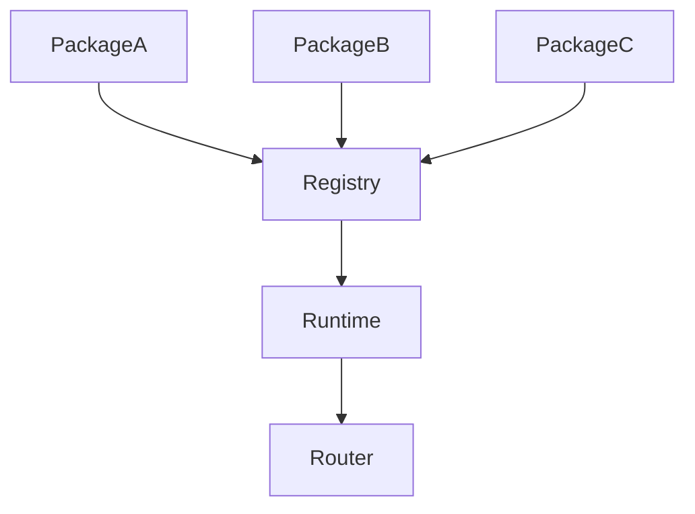
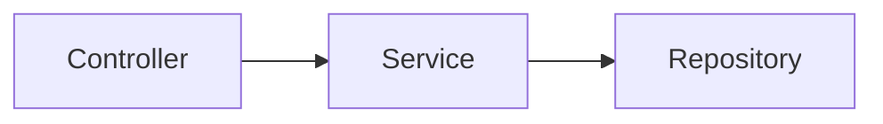
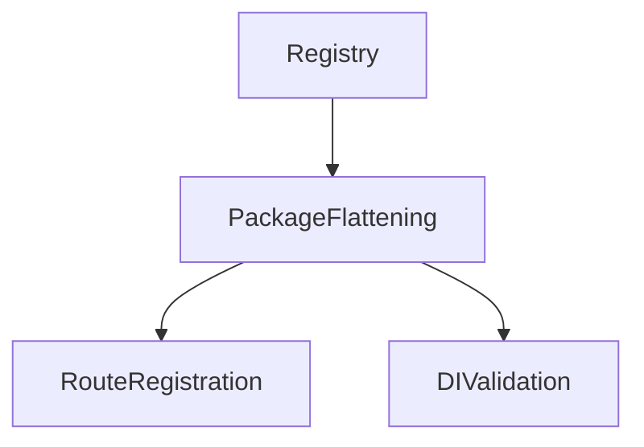

# Architecture

SculptorTS is package-aware, registry-aware, and explicit about DI.

## Package Composition

Packages are the primary feature-slice contract.

Practical meaning:

- each package owns its index
- the index describes its runtime pieces
- `sculptor.packages.json` tracks ownership and file state
- the runtime flattens package definitions internally

## DI Relationships

DI stays explicit:

- `@AutoInject(...)` is required
- constructors and properties are both supported
- no hidden autowiring occurs

## Runtime Composition

At runtime the framework:

- flattens package definitions
- validates the provider graph
- detects route collisions
- registers middleware
- mounts controllers and functional routers

## Modes

Sculptor supports three modes in one framework:

- decorator
- functional
- hybrid

Hybrid mode is still explicit. It simply lets class-based and functional composition live in one app.

## Hybrid Route Convention

Hybrid package scaffolds intentionally generate a functional route at `"/route"` relative to the package prefix.

That convention prevents the generated functional route from colliding with the package controller's default `"/"` route.

Example:

- controller route: `GET /users`
- functional route: `GET /users/route`

This is deliberate and documented so the generated package stays collision-safe.

## Related Docs

- [Framework Lifecycle](framework-lifecycle.md)
- [Error Handling](error-handling.md)
- [Application Patterns](application-patterns.md)
