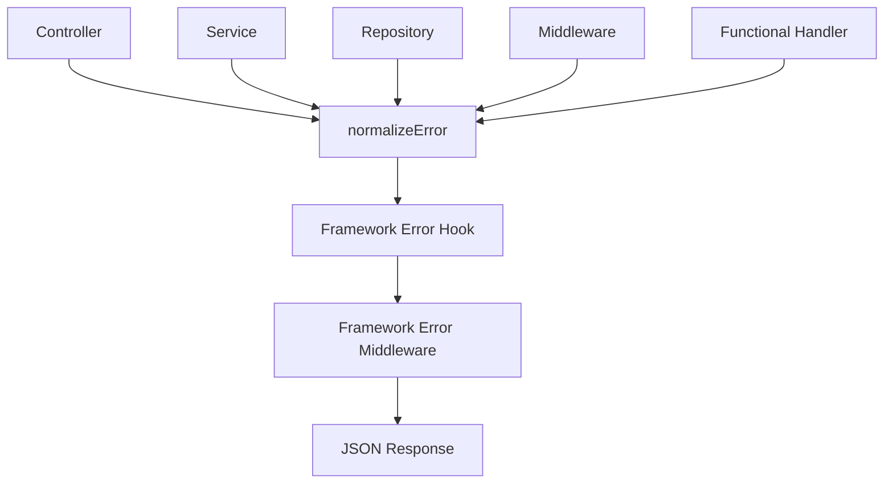

# Error Handling

SculptorTS keeps runtime errors inside a single framework pipeline.

## Error Pipeline



The runtime goal is simple:

1. normalize whatever was thrown
2. call the framework hook when one exists
3. send a consistent JSON response

## What Gets Normalized

`normalizeError()` turns these values into `SculptorError` instances:

- `Error`
- `HttpError`
- `SculptorError`
- strings
- numbers, booleans, and bigints
- symbols
- plain objects

Anything unknown becomes a `RuntimeError`.

## Response Shape

The framework error middleware returns:

```json
{
  "error": {
    "code": "RUNTIME_ERROR",
    "message": "Something went wrong",
    "status": 500
  }
}
```

## Framework Hook

`startApp({ onError })` and `bootstrapApp({ onError })` can receive a hook.

The hook receives:

- the normalized error
- the request
- the response
- route metadata when available
- controller metadata when available
- the request context from `req.ctx`
- a timestamp

The hook is treated as a side effect. If it throws, the framework still emits the JSON error response.

## Express Interoperability

Sculptor keeps Express compatibility:

- controller route handlers are wrapped so sync and async throws stay inside the framework
- functional route handlers are wrapped the same way
- middleware is wrapped before registration
- the framework error middleware is mounted last

This prevents raw Express HTML error pages in normal framework flows.

## Custom Errors

Use these built-in error classes:

- `SculptorError`
- `HttpError`
- `RuntimeError`

`HttpError` is the best option for client-facing status codes.

## Practical Rule

If a framework-owned resource throws, the framework should normalize it and return JSON, regardless of routing style.

## Related Docs

- [Framework Lifecycle](framework-lifecycle.md)
- [Architecture](architecture.md)
