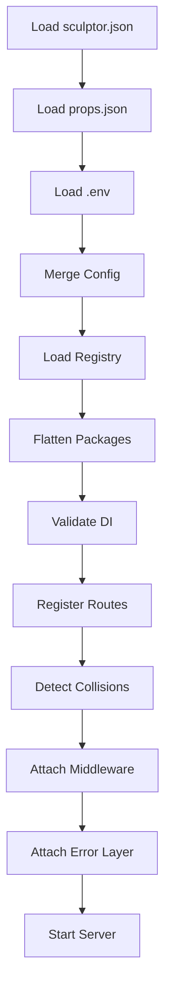
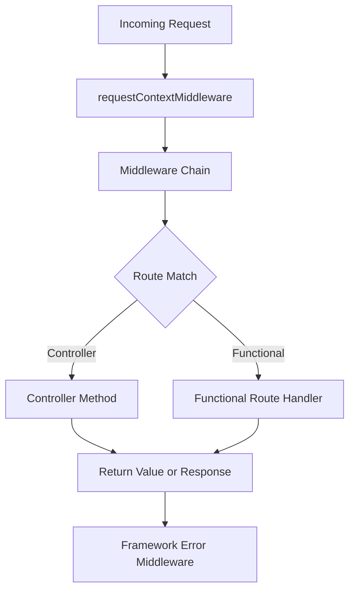
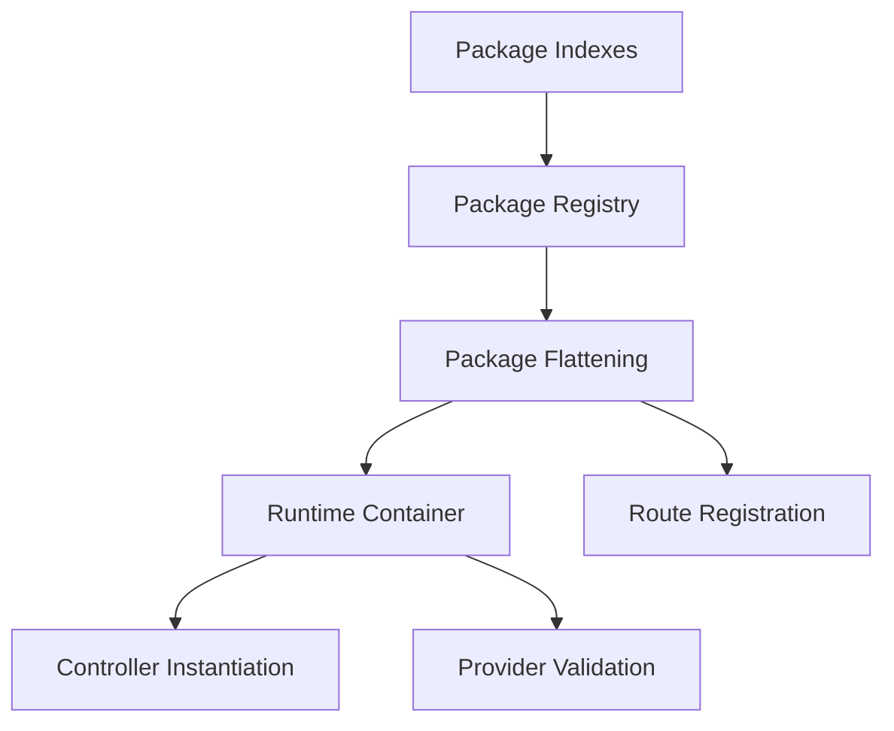

# Framework Lifecycle

This document describes the runtime lifecycle used by SculptorTS apps in the current `v1.0.2` release line.

## Application Startup

Startup happens through `startApp()` in `@sculptor/core`.

What happens in practice:

1. `@sculptor/config` loads framework and runtime config.
2. `@sculptor/core` resolves the runtime port and Express app.
3. The registry is flattened so package composition stays internal to the runtime.
4. `@sculptor/di` validates constructable providers and package graph consistency.
5. `@sculptor/router` registers controller routes and functional routers.
6. Middleware is attached in order.
7. The framework error middleware is attached last so runtime errors become JSON responses.

## Request Lifecycle

The request context is attached to `req.ctx` before routes run.

## Package Resolution

Package indexes are the package contract. The runtime:

- reads `@Package({...})` package indexes
- preserves package ownership in `sculptor.packages.json`
- flattens package definitions into the app registry
- keeps helper-linked files outside DI registration

## Bootstrap Failures

Bootstrap failures are treated as framework runtime failures.

Examples:

- malformed package metadata
- circular package graphs
- missing providers
- invalid registry shapes

These fail before the server starts so the app does not boot into an inconsistent state.

## Related Docs

- [Architecture](architecture.md)
- [Error Handling](error-handling.md)
- [Application Patterns](application-patterns.md)
